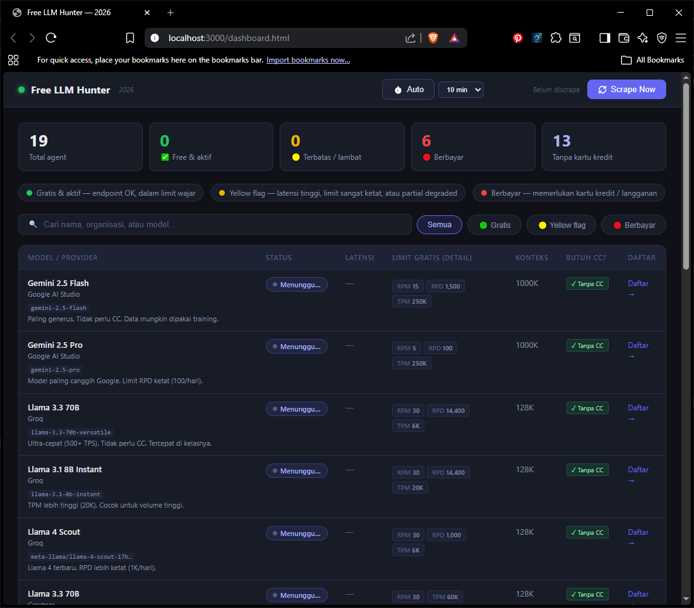

<div align="center">

# 🤖 Free LLM Hunter

### AI Agent Free Tier Monitor — 2026

**Real-time monitoring dashboard for free & paid AI API providers.**

[](https://python.org)
[](LICENSE)
[]()

*Track and compare ALL LLM providers across every AI platform — free tier, paid, self-hosted. Monitor endpoint availability, compare rate limits, and chat from your terminal.*

[Features](#-features) • [Quick Start](#-quick-start) • [Providers](#-monitored-providers) • [API](#-python-api) • [Architecture](#-architecture)




### 📸 Dashboard Preview
</div>

---

## ✨ Features

| Feature | Description |
|---------|-------------|
| 🔴🟢🟡 **Real-time Status** | Ping AI endpoints and measure latency with color-coded results |
| 📊 **Rate Limit Tracking** | RPM, RPD, TPM, TPD limits for every free tier provider |
| ⏱️ **Auto-Refresh** | Configurable polling interval (5/10/15/30 min) with countdown |
| 🔍 **Search & Filter** | Instant search by name, org, or model. Filter by free/flag/paid |
| 🐍 **Python Scraper** | Async CLI tool using `aiohttp` for programmatic access |
| 🌐 **Web Dashboard** | Single-file HTML/CSS/JS with dark theme — zero dependencies |
| 📦 **Single Source of Truth** | All provider data in `agents.json` — edit once, reflected everywhere |

---

## 🚀 Quick Start

### Option 1: Web Dashboard (Recommended)

```bash
# Start local server
python serve.py

# Open http://localhost:8080 in your browser
# Click "Scrape Now" to scan all endpoints
```

### Option 2: llm-hunter CLI (Terminal Agent)

```bash
# List all providers with live status
python llm.py list

# Chat with a free model (coming soon)
python llm.py chat --model gemini-2.5-flash
```

### Option 3: Python Scraper CLI

```bash
# Install dependency
pip install aiohttp

# Run scraper and print JSON
python scraper.py

# Save results to file
python scraper.py > results.json
```

### Option 4: Programmatic Usage

```python
from scraper import run_scrape

data = run_scrape()

# Filter active free providers
free_active = [
    a for a in data["agents"]
    if a["type"] == "free" and a["result"]["status"] == "available"
]

for agent in free_active:
    print(f"✅ {agent['name']} — {agent['result']['latency_ms']}ms")
```

---

## 📡 Monitored Providers

### 🟢 Free Tier (No Credit Card Required)

| Provider | Model | RPM | RPD | TPM | Context |
|----------|-------|-----|-----|-----|---------|
| **Google AI Studio** | Gemini 2.5 Flash | 15 | 1,500 | 250K | 1M |
| **Google AI Studio** | Gemini 2.5 Pro | 5 | 100 | 250K | 1M |
| **Groq** | Llama 3.3 70B | 30 | 14,400 | 6K | 128K |
| **Groq** | Llama 3.1 8B | 30 | 14,400 | 20K | 128K |
| **Groq** | Llama 4 Scout | 30 | 1,000 | 6K | 128K |
| **Cerebras** | Llama 3.3 70B | 30 | — | 60K | 128K |
| **Fireworks AI** | Llama 3.3 70B | 10 | — | — | 65K |
| **OpenRouter** | 28+ models | 20 | 50 | — | 262K |
| **Mistral** | Open Models | — | — | — | 128K |
| **Cohere** | Command R+ | 5 | — | — | 128K |
| **Cloudflare** | Workers AI | — | — | — | 128K |
| **NVIDIA NIM** | 91 models | — | — | — | 128K |
| **Hugging Face** | Serverless API | — | — | — | 128K |

### 🔴 Paid Providers

| Provider | Model | Input / 1M tokens | Output / 1M tokens |
|----------|-------|-------------------|---------------------|
| **OpenAI** | GPT-4o / GPT-4o mini | $2.50 | $10.00 |
| **Anthropic** | Claude Sonnet 4.6 | $3.00 | $15.00 |
| **xAI** | Grok-2 | $2.00 | $10.00 |
| **DeepSeek** | DeepSeek-V3 | $0.27 | $1.10 |
| **Together AI** | 200+ models | Varies | Varies |
| **Perplexity** | Sonar API | Varies | Varies |

---

## 🎬 Demo

### Terminal Recording

```bash
# Record with PowerSession
PowerSession rec demo.cast -c "python scraper.py" --stdin

# Convert to GIF with agg (when available)
agg demo.cast demo.gif
```

> 💡 **Try it yourself!** Open terminal, run the commands above, and see the scraper in action.

---

## 🏗️ Architecture

```
free-llm-hunter/
├── agents.json          # 📋 Single source of truth (unlimited providers)
├── llm.py               # 🤖 CLI agent (llm-hunter)
├── dashboard.html       # 🌐 Web dashboard (loads agents.json)
├── scraper.py           # 🐍 Async Python scraper
├── serve.py             # 🖥️ Local HTTP server (one-liner)
└── README.md            # 📖 This file
```

### Data Flow

```
agents.json ──→ scraper.py   (json.load at import)
             ──→ dashboard.html (fetch via serve.py)
             ──→ llm.py       (provider configs + live status)
```

**Adding a new provider?** Just edit `agents.json` — both scraper and dashboard pick up changes automatically.

---

## 🔧 Python API Reference

### `run_scrape() → dict`

Runs a full scrape of all providers. Returns:

```python
{
    "scraped_at": "2026-07-30T12:00:00",
    "total": 19,
    "free_count": 13,
    "paid_count": 6,
    "agents": [
        {
            "id": "groq-llama3-70b",
            "name": "Llama 3.3 70B",
            "org": "Groq",
            "type": "free",
            "endpoint": "https://api.groq.com/openai/v1/models",
            "result": {
                "agent_id": "groq-llama3-70b",
                "status": "available",    # "available" | "flag" | "unavailable"
                "latency_ms": 142,
                "http_code": 200,
                "error": null,
                "scraped_at": "2026-07-30T12:00:05"
            }
        },
        # ...
    ]
}
```

### Status Codes

| Status | Meaning |
|--------|---------|
| `available` | Endpoint active, latency < 1.5s |
| `flag` | Yellow flag — latency > 1.5s or timeout |
| `unavailable` | Endpoint down or unreachable |

---

## 🎨 Dashboard Features

- **Dark Theme** — AMOLED-optimized with green/yellow/red color coding
- **Real-time Scraping** — Async parallel pings with 8s timeout
- **Search & Filter** — Instant client-side filtering
- **Auto-Refresh** — Configurable polling with countdown timer
- **Latency Display** — Color-coded response times (green < 600ms < yellow < 2s < red)
- **Credit Card Badge** — Shows which providers require CC
- **Responsive** — Works on desktop and mobile

---

## 🛠️ Development

### Prerequisites

- Python 3.10+
- `aiohttp` (for scraper)

### Adding a Provider

Edit `agents.json`:

```json
{
    "id": "my-provider",
    "name": "My Provider",
    "org": "Company Name",
    "type": "free",
    "endpoint": "https://api.example.com/v1/models",
    "models": ["model-name"],
    "limits": {
        "rpm": 100,
        "rpd": 1000,
        "tpm": 10000,
        "tpd": null,
        "context_k": 128
    },
    "notes": "Description of the provider.",
    "signup_url": "https://example.com/signup",
    "requires_card": false
}
```

### Limit Fields

| Field | Description |
|-------|-------------|
| `rpm` | Requests per minute |
| `rpd` | Requests per day |
| `tpm` | Tokens per minute |
| `tpd` | Tokens per day |
| `context_k` | Context window in thousands of tokens |

---

## 📄 License

MIT License — see [LICENSE](LICENSE) for details.

---

## 🤝 Contributing

Contributions are welcome! To add a new provider:

1. Fork the repository
2. Edit `agents.json` with the new provider data
3. Submit a pull request

---

<div align="center">

**Built with ❤️ for the AI developer community**

[⬆ Back to top](#-free-llm-hunter)

</div>
